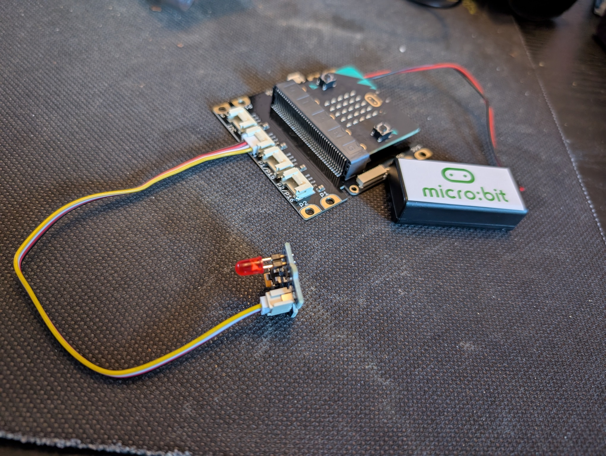

# inbraakAlarm
Een project voor de bibliotheek Heerenveen waar we een inbraak alarm bouwen. 

Wat heb je nodig
- een micro.bit
- een grove inventorkit
- een laptop met internet (https://makecode.microbit.org/)

Onderstaande stappen laten je kennis maken met alle onderdelen. Probeer eerst zelf de oplossing te maken. Bij iedere stap zit een uitwerking, deze kun je bekijken als je zelf er even niet uitkomt.

## Welkom (stap1)
**doel:** micro.bit leren kennen  
**wat moet je done?** Zorg voor een melding, bijvoorbeeld je naam, op het scherm.

<details>
<summary>uitwerking: Welkom (stap1)</summary>


```javascript
input.onGesture(Gesture.Shake, function () {
    basic.showString("Hello!")
})
basic.showIcon(IconNames.Happy)
```
</details>

## Alarm! (stap2)
**doel:** grove leren kennen  
**wat moet je doen?** Ansluiten grove led. Als je op de knop A drukt moet de micro.bit één keer geluid maken het de led driekeer laten knipperen 

> [!TIP]
> Zorg ervoor dat je de groveinstructie set benaderbaar maakt in makecode. Dit doe je door bij uitbreidingen, grove te selecteren.

<details>
<summary>uitwerking: Alarm! (stap2)</summary>




```javascript
input.onGesture(Gesture.Shake, function () {
    basic.showString("Hello!")
})
basic.showIcon(IconNames.Happy)
```
</details>


## Boef gedetecteerd (stap3)
***doel:** inbraakalarm bouwen, basis versie  
**wat moet je doen?** aansluiten bewegingssensor en zorgen dat het alarm afgaat als iemand in de buurt komt.

<details>
<summary>uitwerking: Boef gedetecteerd (stap3)</summary>


```javascript
input.onGesture(Gesture.Shake, function () {
    basic.showString("Hello!")
})
basic.showIcon(IconNames.Happy)
```
</details>


## hoe wil je het inbraakalarm uitbreiden? (extra stap)
**surgesties: **
* led strip gebruiken ipv led [moeilijkheidsgraad: MIDDEN]
* tellen hoe vaak het alarm is afgegaan en op het schermpje tonen [moeilijkheidsgraad: MIDDEN]
* radio sigaal doorsturen naar de tweede micro.bit [moeilijkheidsgraad: MOEILIJK]
